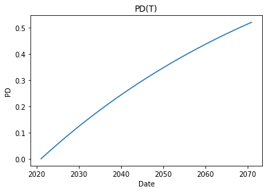

```python
import pandas as pd
import matplotlib.pyplot as plt 
import time

import numpy as np
import scipy as sp
import scipy.interpolate

from datetime import datetime, timedelta
from dateutil.relativedelta import relativedelta

from numba import jit
```


```python
def get_month(x):
    return x.month

def get_day(x):
    return x.day

def log_interp1d(xx, yy, kind='linear'):
    logx = np.log10(xx)
    logy = np.log10(yy)
    lin_interp = sp.interpolate.interp1d(logx, logy, kind=kind)
    log_interp = lambda zz: np.power(10.0, lin_interp(np.log10(zz)))
    return log_interp
```


```python

```


```python

```


```python
data = pd.read_excel('Bloom_EUR_OIS.xlsx')
```


```python
data.head()
```


<div>
<style scoped>
    .dataframe tbody tr th:only-of-type {
        vertical-align: middle;
    }

    .dataframe tbody tr th {
        vertical-align: top;
    }

    .dataframe thead th {
        text-align: right;
    }
</style>
<table border="1" class="dataframe">
  <thead>
    <tr style="text-align: right;">
      <th></th>
      <th>Payment Date</th>
      <th>Maturity Date</th>
      <th>Market Rate</th>
      <th>Shift (bp)</th>
      <th>Shifted Rate</th>
      <th>Zero Rate</th>
      <th>Discount</th>
      <th>Source</th>
    </tr>
  </thead>
  <tbody>
    <tr>
      <th>0</th>
      <td>01/06/2021</td>
      <td>01/06/2021</td>
      <td>-0.4980</td>
      <td>0</td>
      <td>-0.4980</td>
      <td>-0.504920</td>
      <td>1.000014</td>
      <td>CASH</td>
    </tr>
    <tr>
      <th>1</th>
      <td>01/12/2021</td>
      <td>01/12/2021</td>
      <td>-0.4700</td>
      <td>0</td>
      <td>-0.4700</td>
      <td>-0.476550</td>
      <td>1.000091</td>
      <td>DETAILED_SWAP</td>
    </tr>
    <tr>
      <th>2</th>
      <td>01/19/2021</td>
      <td>01/19/2021</td>
      <td>-0.4700</td>
      <td>0</td>
      <td>-0.4700</td>
      <td>-0.476572</td>
      <td>1.000183</td>
      <td>DETAILED_SWAP</td>
    </tr>
    <tr>
      <th>3</th>
      <td>02/05/2021</td>
      <td>02/05/2021</td>
      <td>-0.4719</td>
      <td>0</td>
      <td>-0.4719</td>
      <td>-0.478551</td>
      <td>1.000407</td>
      <td>DETAILED_SWAP</td>
    </tr>
    <tr>
      <th>4</th>
      <td>03/05/2021</td>
      <td>03/05/2021</td>
      <td>-0.4750</td>
      <td>0</td>
      <td>-0.4750</td>
      <td>-0.481785</td>
      <td>1.000779</td>
      <td>DETAILED_SWAP</td>
    </tr>
  </tbody>
</table>
</div>


```python

```


```python
class Stripper():
    def __init__(self, data, start='2020-12-31', end='2071-01-05',1.04, freq = 3, K = 4/100): #yyyy-mm-dd
        
        self.price = price
        self.freq = freq
        self.K = K
        self.data = data
        self.start = datetime.strptime(start,'%Y-%m-%d')
        self.end = datetime.strptime(end,'%Y-%m-%d')
        
        self.total_dates = [datetime.strptime(data['Payment Date'][0],'%m/%d/%Y')]
        
        while self.total_dates[-1] < self.end:
            self.total_dates.append(self.total_dates[-1] + relativedelta(months=+freq))
            
        while self.total_dates[-1] != self.end:
            self.total_dates[-1] -= timedelta(days=1)
            
        self.total_days = [(date-self.start).days for date in self.total_dates]
        
        ### Interpolation
        
        data_t  = [(datetime.strptime(date,'%m/%d/%Y') - self.start).days for date in data['Payment Date']]
        data_df = data['Discount']
        d
        
        self.DF = np.vectorize(log_interp1d(data_t, data_df))(self.total_days)
        #self.PRICES = np.vectorize(log_interp1d(data_t, data_price))(self.total_days)
        
        
        ### Creation DataFrame
        self.delta = 1/365
        self.BC = np.array([day * self.delta for day in (self.total_days)])
        self.df = pd.DataFrame({'Date':self.total_dates,'Days':self.total_days,'DF':self.DF,'BC':self.BC})
        
        self.CF = list(K * self.df['DF'] * self.df['BC'])
        self.CF[-1] += 1
        
        self.df['CF'] = self.CF
        
        
        ### 
        

    def F(self,S,T):
        return (self.DF[S]/self.DF[T]-1) / (self.freq*self.delta)

    
    
    def polynome(self, p,LGD=.6):

        n = len(self.DF)
        zero_target = self.DF[n-1]*p**self.BC[n-1] 
        
        for i in range(len(self.DF)):
            zero_target += self.DF[i]* \
                            (
                            p**self.BC[i] * self.F(i-1,i) * self.delta + \
                            (p**self.BC[i-1] - p**self.BC[i] )*(1-LGD)
                            )
            
            
        zero_target += self.DF[n-1] * p**self.BC[n-1]
        zero_target -= self.price
        
        return zero_target

    
    
    def solve_polynome(self, epsilon = 1e-8):

        left = 0
        right= 1

        while right-left>epsilon :

            mid = (left+right) / 2
            if (self.polynome(left))*(self.polynome(mid)) < 0:
                right = mid
            else:
                left = mid

        return left
    
    
    def get_PS_1year(self):
        self.p = self.solve_polynome()
        return self.p
    
    def get_PS(self):
        
        self.PS_1year = self.get_PS_1year()
        
        self.PS = [self.PS_1year**delta for delta in self.BC]
        
        self.df['PS'] = self.PS
        self.df['PD'] = 1 - self.df['PS']
        
        
```


```python

```


```python

```


```python
stripper = Stripper(data)
```


```python
stripper.df.head()
```


<div>
<style scoped>
    .dataframe tbody tr th:only-of-type {
        vertical-align: middle;
    }

    .dataframe tbody tr th {
        vertical-align: top;
    }

    .dataframe thead th {
        text-align: right;
    }
</style>
<table border="1" class="dataframe">
  <thead>
    <tr style="text-align: right;">
      <th></th>
      <th>Date</th>
      <th>Days</th>
      <th>DF</th>
      <th>BC</th>
      <th>CF</th>
    </tr>
  </thead>
  <tbody>
    <tr>
      <th>0</th>
      <td>2021-01-06</td>
      <td>6</td>
      <td>1.000014</td>
      <td>0.016438</td>
      <td>0.000658</td>
    </tr>
    <tr>
      <th>1</th>
      <td>2021-04-06</td>
      <td>96</td>
      <td>1.001209</td>
      <td>0.263014</td>
      <td>0.010533</td>
    </tr>
    <tr>
      <th>2</th>
      <td>2021-07-06</td>
      <td>187</td>
      <td>1.002481</td>
      <td>0.512329</td>
      <td>0.020544</td>
    </tr>
    <tr>
      <th>3</th>
      <td>2021-10-06</td>
      <td>279</td>
      <td>1.003824</td>
      <td>0.764384</td>
      <td>0.030692</td>
    </tr>
    <tr>
      <th>4</th>
      <td>2022-01-06</td>
      <td>371</td>
      <td>1.005193</td>
      <td>1.016438</td>
      <td>0.040869</td>
    </tr>
  </tbody>
</table>
</div>


```python


```


```python

t1 = time.time()
stripper.get_PS()
print("Execution time = {}s".format(round(time.time()-t1,3)))
```

    Execution time = 0.04s


```python
stripper.df
```


<div>
<style scoped>
    .dataframe tbody tr th:only-of-type {
        vertical-align: middle;
    }

    .dataframe tbody tr th {
        vertical-align: top;
    }

    .dataframe thead th {
        text-align: right;
    }
</style>
<table border="1" class="dataframe">
  <thead>
    <tr style="text-align: right;">
      <th></th>
      <th>Date</th>
      <th>Days</th>
      <th>DF</th>
      <th>BC</th>
      <th>CF</th>
      <th>PS</th>
      <th>PD</th>
    </tr>
  </thead>
  <tbody>
    <tr>
      <th>0</th>
      <td>2021-01-06</td>
      <td>6</td>
      <td>1.000014</td>
      <td>0.016438</td>
      <td>0.000658</td>
      <td>0.999759</td>
      <td>0.000241</td>
    </tr>
    <tr>
      <th>1</th>
      <td>2021-04-06</td>
      <td>96</td>
      <td>1.001209</td>
      <td>0.263014</td>
      <td>0.010533</td>
      <td>0.996156</td>
      <td>0.003844</td>
    </tr>
    <tr>
      <th>2</th>
      <td>2021-07-06</td>
      <td>187</td>
      <td>1.002481</td>
      <td>0.512329</td>
      <td>0.020544</td>
      <td>0.992525</td>
      <td>0.007475</td>
    </tr>
    <tr>
      <th>3</th>
      <td>2021-10-06</td>
      <td>279</td>
      <td>1.003824</td>
      <td>0.764384</td>
      <td>0.030692</td>
      <td>0.988868</td>
      <td>0.011132</td>
    </tr>
    <tr>
      <th>4</th>
      <td>2022-01-06</td>
      <td>371</td>
      <td>1.005193</td>
      <td>1.016438</td>
      <td>0.040869</td>
      <td>0.985225</td>
      <td>0.014775</td>
    </tr>
    <tr>
      <th>...</th>
      <td>...</td>
      <td>...</td>
      <td>...</td>
      <td>...</td>
      <td>...</td>
      <td>...</td>
      <td>...</td>
    </tr>
    <tr>
      <th>196</th>
      <td>2070-01-06</td>
      <td>17903</td>
      <td>1.066163</td>
      <td>49.049315</td>
      <td>2.091782</td>
      <td>0.487570</td>
      <td>0.512430</td>
    </tr>
    <tr>
      <th>197</th>
      <td>2070-04-06</td>
      <td>17993</td>
      <td>1.066839</td>
      <td>49.295890</td>
      <td>2.103631</td>
      <td>0.485813</td>
      <td>0.514187</td>
    </tr>
    <tr>
      <th>198</th>
      <td>2070-07-06</td>
      <td>18084</td>
      <td>1.067520</td>
      <td>49.545205</td>
      <td>2.115619</td>
      <td>0.484042</td>
      <td>0.515958</td>
    </tr>
    <tr>
      <th>199</th>
      <td>2070-10-06</td>
      <td>18176</td>
      <td>1.068205</td>
      <td>49.797260</td>
      <td>2.127747</td>
      <td>0.482259</td>
      <td>0.517741</td>
    </tr>
    <tr>
      <th>200</th>
      <td>2071-01-05</td>
      <td>18267</td>
      <td>1.068880</td>
      <td>50.046575</td>
      <td>3.139751</td>
      <td>0.480501</td>
      <td>0.519499</td>
    </tr>
  </tbody>
</table>
<p>201 rows × 7 columns</p>
</div>


```python
plt.plot(stripper.df['Date'],stripper.df['PD'])
plt.xlabel('Date')
plt.ylabel('PD')
plt.title('PD(T)')
plt.show()
```





```python
stripper.get_PS_1year()
```


    0.9854618459939957


```python

```
